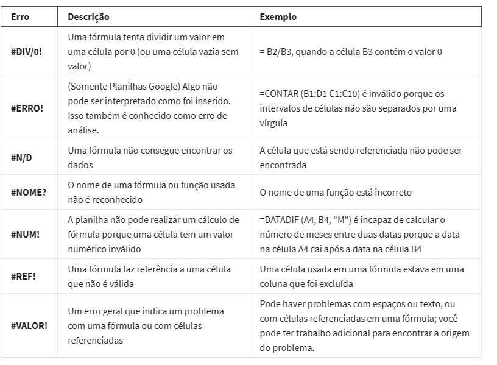

# Anotações - Google

- Atributo

Um atributo é uma característica ou qualidade de dados usada para rotular uma coluna em uma tabela. É basicamente rotular o tipo de dados em cada coluna. 

- Fórmulas paro o sucesso

- Operadores matemáticos

Os operadores matemáticos usados em fórmulas de planilhas incluem:

Subtração – sinal de menos ( - )

Adição – sinal de mais ( + )

Divisão – barra ( / )

Multiplicação – asterisco ( * )

- Referência absoluta

A referência absoluta é marcada por um cifrão ($). Por exemplo, = $A$10 tem referência absoluta para a coluna e o valor da linha

As referências relativas (que é o que você normalmente faz, por exemplo, “= A10”) serão alteradas sempre que a fórmula for copiada e colada. Elas estão relacionadas ao local onde a célula referenciada está localizada. Por exemplo, se você copiou “= A10” para a célula à direita, ela se tornaria “= B10”. Com a referência absoluta “= $A$10” copiada para a célula à direita permaneceria “= $A$10”. Mas se você copiasse $A10 para a célula abaixo, mudaria para $A11 pois o valor da linha não é uma referência absoluta.

As referências absolutas não serão alteradas quando você copiar e colar a fórmula em uma célula diferente. A célula que está sendo referenciada é sempre a mesma.

Para alternar facilmente entre a referência absoluta e relativa na barra de fórmulas, destaque a referência que deseja alterar e pressione a tecla F4; por exemplo, se você deseja alterar a referência absoluta, $A$10, em sua fórmula para uma referência relativa, A10, destaque a $A$10 na barra de fórmula e pressione a tecla F4 para fazer a alteração.

- Intervalo de dados

Quando você clica em sua fórmula, os intervalos coloridos permitem que você veja quais células estão sendo usadas em sua planilha. Existem cores diferentes para cada intervalo exclusivo em sua fórmula.

Em muitos aplicativos de planilha, você pode pressionar a tecla F2 (ou Enter) para destacar o intervalo de dados na planilha que é referenciado em uma fórmula. Clique na célula com a fórmula e pressione a tecla F2 (ou Enter) para destacar os dados em sua planilha.

- Combinar com as funções

COUNTIF() é uma fórmula e uma função. Isso significa que a função é executada com base nos critérios definidos pela fórmula. Nesse caso, CONTAR é a fórmula; ele será executado SE as condições que você criar forem verdadeiras. Por exemplo, você pode usar =COUNTIF(A1:A16, “7”) para contar apenas as células que continham o número 7. Combinar fórmulas e funções permite que você trabalhe mais com um único comando.

# Erros e Correções nas Planilhas

- #DIV/0 > Division for 0
    - = IFERROR

- #ERROR! 

- #N/A > Data cant be found by spreadsheet

- #NUM! > Can't be perfomed 

- #VALUE! > Formula or cells

- #REF! > A formula referencing a cell has been deleted

- Problem Domain

