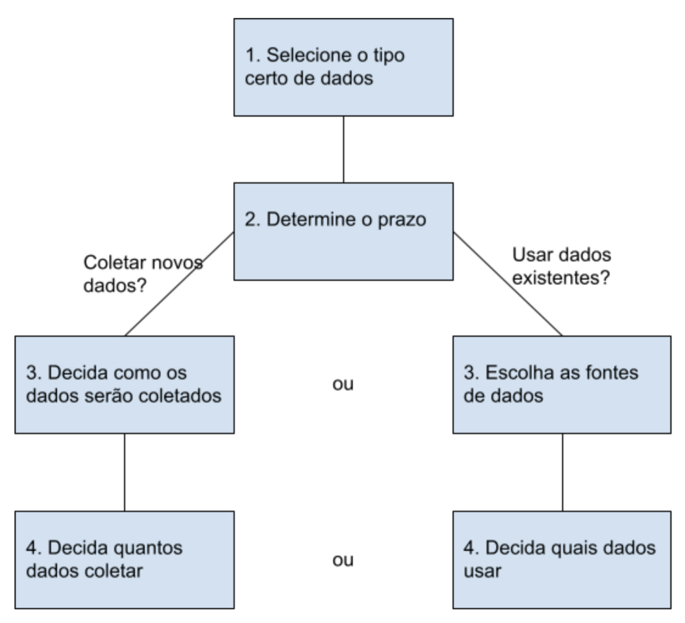

# Selecionando os Dados Certos

Aqui estão algumas considerações de coleta de dados a serem lembradas para sua análise:

### Como os Dados Serão Coletados
Decida se você coletará os dados usando seus próprios recursos ou se os receberá (e possivelmente os comprará) de outra parte. Os dados que você mesmo coleta são chamados de dados primários.

### Fontes de Dados
Se você não coletar os dados usando seus próprios recursos, poderá obter dados de provedores de dados terceirizados. Os dados de terceiros são coletados diretamente por outro grupo e, em seguida, vendidos. Os dados de terceiros são vendidos por um provedor que não os coletou. Os dados de terceiros podem vir de várias fontes diferentes.

### Resolvendo Seu Problema de Negócios
Os conjuntos de dados podem mostrar muitas informações interessantes. Porém, certifique-se de escolher dados que possam realmente ajudar a resolver sua dúvida do problema. Por exemplo, se você estiver analisando tendências ao longo do tempo, certifique-se de usar dados de série temporal — em outras palavras, dados que incluem datas.

### Quantos Dados Coletar
Se você estiver coletando seus próprios dados, tome decisões razoáveis sobre o tamanho da amostra. Uma amostra aleatória de dados existentes pode ser adequada para alguns projetos. Outros projetos podem precisar de coleta de dados mais estratégicos para se concentrar em determinados critérios. Cada projeto tem suas próprias necessidades.

### Prazo
Se você estiver coletando seus próprios dados, decida quanto tempo precisará coletá-los, especialmente se estiver acompanhando tendências por um longo período. Se precisar de uma resposta imediata, você pode não ter tempo para coletar novos dados. Nesse caso, você precisaria usar dados históricos já existentes.

Use o fluxograma abaixo se a coleta de dados depende muito de quanto tempo você tem:

# Formatos de Dados na Prática

Quando você pensa sobre a palavra "formato", muitas coisas podem vir à sua mente. Pense em um anúncio de sua loja favorita. Você pode encontrá-lo na forma de um anúncio impresso, um outdoor ou mesmo um comercial. As informações são apresentadas no formato que funciona melhor para você. O formato de um conjunto de dados é muito parecido com isso, e escolher o formato certo o ajudará a gerenciar e usar seus dados da melhor maneira possível.

## Exemplos de Formato de Dados

Como acontece com a maioria das coisas, é mais fácil clicar nas definições quando podemos combiná-las com exemplos da vida real. Revise cada definição primeiro e, em seguida, use os exemplos para fixar sua compreensão de cada formato de dados.

### Primário vs. Secundário

A tabela a seguir destaca as diferenças entre os dados primários e secundários e exemplos de cada:

#### Classificação do Formato de Dados

- **Definição**
- **Exemplos**

#### Dados primários

- Coletados por um pesquisador em fontes de primeira mão
- Exemplos:
  - Dados de uma entrevista que você conduziu
  - Dados de uma pesquisa retornada de 20 participantes
  - Dados de questionários que você recebeu de um grupo de trabalhadores

#### Dados secundários

- Recolhido por outras pessoas ou de outra pesquisa
- Exemplos:
  - Dados que você comprou dos perfis de clientes de uma empresa de análise de dados local
  - Dados demográficos coletados por uma universidade
  - Dados do censo coletados pelo governo federal

### Interno vs. Externo

A tabela a seguir destaca as diferenças entre os dados internos e externos e exemplos de cada:

#### Classificação do Formato de Dados

- **Definição**
- **Exemplos**

#### Dados internos

- Dados que residem nos próprios sistemas da empresa
- Exemplos:
  - Salários de funcionários em diferentes unidades de negócios monitorados pelo RH
  - Dados de vendas por localização da loja
  - Níveis de estoque de produtos nos centros de distribuição

#### Dados externos

- Dados que residem fora de uma empresa ou organização
- Exemplos:
  - Salários médios nacionais para os vários cargos em sua organização
  - Relatórios de crédito para clientes de uma concessionária de automóveis

### Contínuo vs. Discreto

A tabela a seguir destaca as diferenças entre dados contínuos e discretos e exemplos de cada:

#### Classificação do Formato de Dados

- **Definição**
- **Exemplos**

#### Dados contínuos

- Dados que são medidos e que podem ter quase qualquer valor numérico
- Exemplos:
  - Altura das crianças na terceira série (52,5 polegadas, 65,7 polegadas)
  - Marcadores de tempo de execução em um vídeo
  - Temperatura

#### Dados discretos

- Dados contados e que têm um número limitado de valores
- Exemplos:
  - Número de pessoas que visitam um hospital diariamente (10, 20, 200)
  - Capacidade máxima permitida da sala
  - Ingressos vendidos no mês atual

### Qualitativo vs. Quantitativo

A tabela a seguir destaca as diferenças entre dados qualitativos e quantitativos e exemplos de cada:

#### Classificação do Formato de Dados

- **Definição**
- **Exemplos**

#### Qualitativos

- Medidas subjetivas e explicativas de qualidades e características
- Exemplos:
  - Atividade de exercício mais apreciada
  - Marcas favoritas dos clientes mais fiéis
  - Preferências de moda de jovens adultos

#### Quantitativos

- Medidas específicas e objetivas de fatos numéricos
- Exemplos:
  - Porcentagem de médicos certificados que são mulheres
  - População de elefantes na África
  - Distância da Terra a Marte

### Nominais vs. Ordinais

A tabela a seguir destaca as diferenças entre os dados nomina
