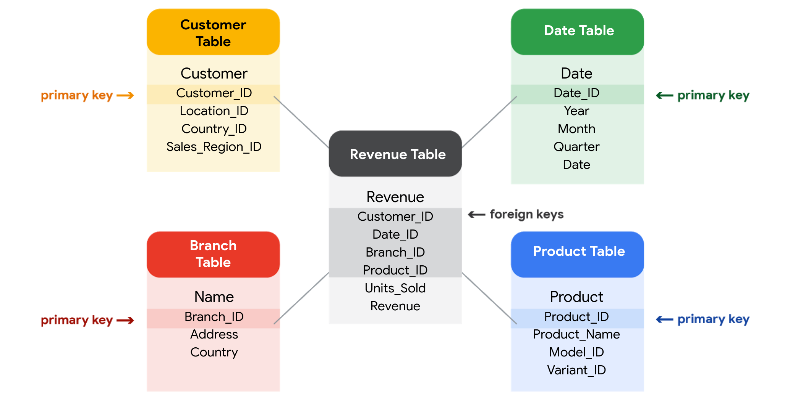

# Database

- Relational Database
- Primary Key
- Foreign key

# Bancos de Dados em Análise de Dados

Os bancos de dados permitem aos analistas manipular, armazenar e processar dados. Isso ajuda a pesquisar os dados com muito mais eficiência para obter as melhores ideias.

## Banco de Dados Relacional

Um banco de dados relacional é um banco de dados que contém uma série de tabelas que podem ser conectadas para mostrar as relações. Eles permitem, basicamente, que os analistas de dados organizem e liguem os dados com base no que os dados têm em comum.

Em uma tabela não-relacional, você encontrará todas as variáveis possíveis que você possa estar interessado em analisar todas agrupadas. Isso pode dificultar a classificação. Essa é uma razão pela qual os bancos de dados relacionais são tão comuns na análise de dados: eles simplificam muitos processos de análise e tornam os dados mais fáceis de encontrar e usar em todo um banco de dados.

### A Chave para os Bancos de Dados Relacionais

As tabelas em um banco de dados relacional estão conectadas pelos campos que elas têm em comum. Uma chave primária é um identificador que faz referência a uma coluna na qual cada valor é único, enquanto uma chave estrangeira é um campo dentro de uma tabela que é uma chave primária em outra tabela. Uma tabela pode ter apenas uma chave primária, mas pode ter várias chaves estrangeiras. Estas chaves são o que cria as relações entre as tabelas em um banco de dados relacional.

Algumas tabelas não exigem uma chave primária. Uma chave primária também pode ser construída usando múltiplas colunas de uma tabela, conhecida como chave composta.

### Imagem de 5 tabelas:
1. Tabela de clientes.
2. Tabela de receitas.
3. Tabela de filiais.
4. Tabela de datas.
5. Tabela de produtos.

## SQL? Você está falando minha língua

Os bancos de dados utilizam uma linguagem especial para se comunicar, chamada Linguagem de Consulta Estruturada (SQL). SQL é um tipo de linguagem de consulta que permite aos analistas de dados se comunicarem com um banco de dados. Em um banco de dados relacional, os analistas de dados podem escrever consultas para obter dados das tabelas relacionadas. SQL é uma ferramenta poderosa para trabalhar com bancos de dados.
