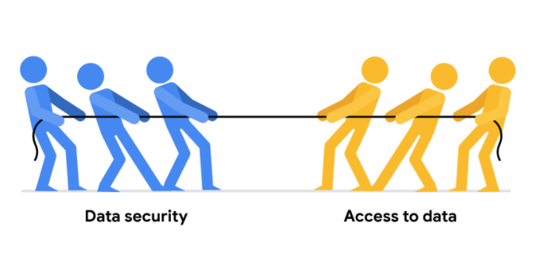

# Como Equilibrar a Segurança e o Data Analytics

## A Luta entre a Segurança e o Data Analytics

**Segurança de dados** é a prática de proteger os dados contra o acesso não autorizado ou a corrupção, implementando medidas de segurança. O objetivo é impedir que usuários não autorizados acessem ou visualizem dados confidenciais. Para os analistas de dados, o desafio é equilibrar a segurança dos dados com as necessidades de Analytics. Queremos manter nossos dados seguros, mas também usá-los de forma eficiente para observações oportunas e relevantes.

As empresas precisam encontrar formas de equilibrar as medidas de segurança de dados com o acesso necessário aos dados.

---

## Medidas de Segurança

Algumas medidas de segurança podem ajudar as empresas a alcançar esse equilíbrio:

### Criptografia
A criptografia utiliza um algoritmo único para alterar dados, tornando-os inutilizáveis por usuários e aplicativos que não conhecem o algoritmo. Este é salvo como uma “chave”, que pode ser usada para reverter a criptografia. Se você tem a chave, ainda pode usar os dados em seu formato original.

### Tokenização
A tokenização substitui elementos de dados que deseja proteger com dados gerados aleatoriamente, conhecidos como “tokens”. Os dados originais são armazenados em um local separado e atribuídos aos tokens. Para acessar os dados originais completos, é necessário ter permissão para usar o dado tokenizado e o mapeamento do token.

Criptografia e tokenização são apenas algumas opções de segurança de dados disponíveis, além de outras alternativas como o uso de dispositivos de autenticação e tecnologia de IA.

---

## Responsabilidade e Conhecimento do Analista de Dados

Como analista de dados júnior, você provavelmente não será responsável por desenvolver esses sistemas. Muitas organizações têm equipes dedicadas à segurança de dados ou contratam empresas especializadas. No entanto, é crucial que todas as empresas mantenham a segurança dos dados e compreendam os sistemas que podem ser implementados.

# Teste 

Excelente trabalho ao reforçar seu aprendizado com uma autorreflexão cuidadosa! Uma ótima observação sobre o assunto incluiria como e quando você deve aplicar seu conhecimento sobre privacidade de dados e controle de versão ao trabalhar no Kaggle.

Entender como manter a privacidade e registrar seu progresso com o controle de versão é uma habilidade fundamental para a função de analista de dados, na qual se espera, em geral, que você trabalhe junto com outros analistas. Se você domina os padrões de privacidade e sabe como garantir uma colaboração efetiva, você ficará livre do risco de expor dados importantes ou perder trabalhos essenciais. Futuramente, você pode usar seu conhecimento sobre a segurança dos dados em outras plataformas ou em projetos futuros.

