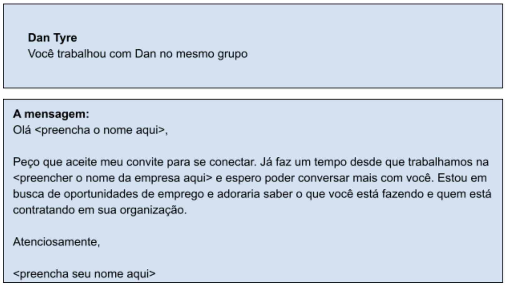
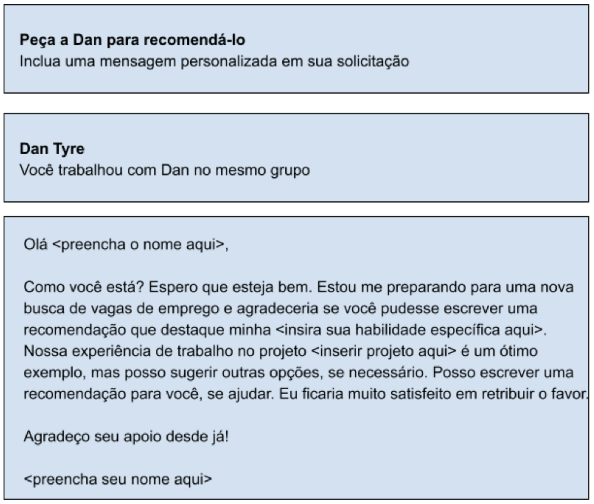

# Dicas para Usar o LinkedIn para Conexões Profissionais

## Fazer Contatos no LinkedIn

O LinkedIn é uma ferramenta poderosa para se conectar profissionalmente. Lembre-se de que é mais importante ter conexões de qualidade do que uma grande quantidade. Aqui estão algumas dicas para construir sua rede:

### Convide Pessoas que Você Conhece
- **Priorize contatos pessoais ou profissionais**: Convide pessoas que você conhece e confia.
- **Adicione uma nota pessoal**: Ao enviar um convite, inclua uma mensagem personalizada.
- **Expanda sua rede**: Considere convidar colegas de classe, amigos, professores e membros de clubes ou organizações.

### Convites Não Solicitados
- **Seja seletivo**: Use convites não solicitados com moderação e apenas quando necessário.
- **Aprenda sobre empresas**: Eles podem ser úteis para se conectar com pessoas em empresas de seu interesse.

## Pedir Recomendações

As recomendações são essenciais no LinkedIn. Elas oferecem credibilidade e destacam suas habilidades e experiências.

### Como Pedir Recomendações
- **Diversifique suas fontes**: Peça recomendações a supervisores, colegas, subordinados, parceiros e clientes.
- **Mensagem personalizada**: Faça um pedido de recomendação único e pessoal.
- **Sugira pontos para destacar**: Informe quais habilidades ou experiências você gostaria que fossem mencionadas.
- **Ofereça-se para retribuir**: Esteja disposto a escrever uma recomendação em troca.
- **Revise antes de aceitar**: Leia cada recomendação cuidadosamente antes de adicioná-la ao seu perfil.

### Exemplo de Pedido de Recomendação

## Resumo

- **Seja ativo**: Publique conteúdos relevantes e interaja sinceramente com sua rede.
- **Busca por emprego**: Use sua rede para auxiliar na procura por oportunidades de emprego.
